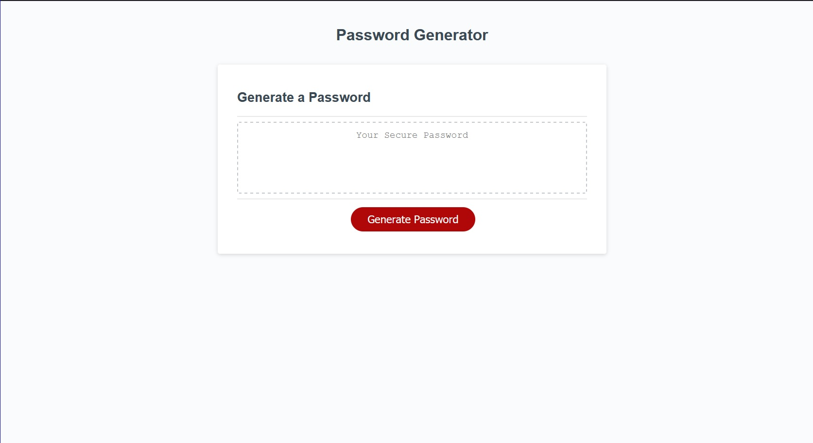

# Password Generator
A handy little tool that will generate a password based on the following parameters:
- Would you like to include lowercase characters?
- Would you like to include uppercase characters?
- Would you like to include numbers?
- Would you like to include special characters?
- How long would you like your password to be?

A link to the generator can be found [here](https://jondagamkd.github.io/password-generator/).

This site was built using [The Visual Studio Code Editor](https://code.visualstudio.com/) and [GitHub Pages](https://pages.github.com/).

All projects within are the property of John T. Woodland.

